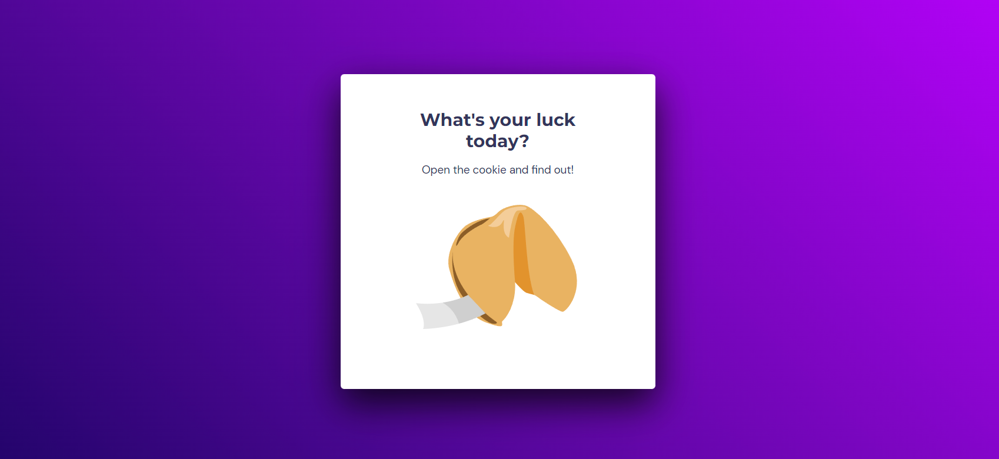
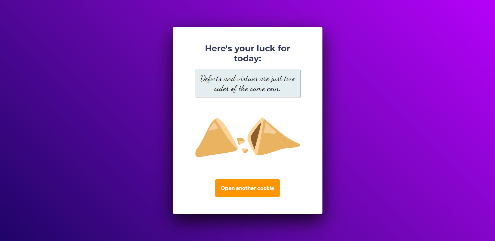

<h1 align="center"> 
  
  Fortune Cookie
</h1>

  

  

## 🚀 Technologies

This project was developed with the following technologies:

- HTML e CSS
- JavaScript
- Figma

## 💻 Project

RocketSeat Explorer Course Module 5 Challenge Delivery.
The project is a fortune cookie.

* It has an amination to break the cookie and another one to show the message.
* Random messages.

- [Access the finished project, online](https://arks-lacerda.github.io/02-focusTimePlus/)

## 🔖 Layout

Project layout [FROM THIS LINK](https://www.figma.com/community/file/1182751789348533739).